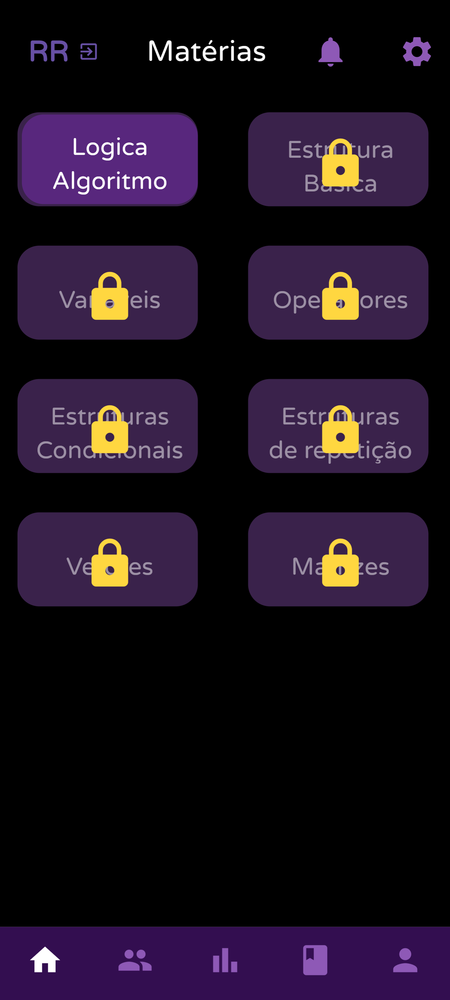

# E++

Este é o repositório do aplicativo E++, um projeto em desenvolvimento utilizando o framework Flutter e a linguagem Dart.

## Status do Projeto

Atualmente, o projeto está em desenvolvimento.

## Tecnologias Utilizadas

- **Framework:** Flutter
- **Linguagem:** Dart

<div style="display: flex; flex-direction: row; gap: 5px;">
     
    
    
</div>

## Estrutura do Projeto

### Capturas de Tela

Todas as capturas de tela tiradas do aplicativo estão disponíveis na pasta `Screenshots` dentro da pasta `Projeto` na raiz do repsitório.

### Diagramas

Os diagramas de caso de uso, classes e sequência estão disponíveis na pasta `Diagramas` dentro da pasta `Projeto` na raiz do repsitório.

### Estrutura Principal da Pasta `lib`

A pasta `lib` contém os arquivos do código-fonte do aplicativo, organizados da seguinte maneira:

- **components:** Contém componentes reutilizáveis (elementos que aparecem várias vezes no aplicativo).
- **controller:** Contém arquivos que fazem a ligação com o Firebase, definindo funções como login, logout, cadastro, entre outros.
- **model:** Contém arquivos referentes às classes dos objetos envolvidos nas operações com o Firebase.
- **pages:** Agrupa todas as telas do aplicativo, subdivididas em cinco subpastas:
  - **auth:** Páginas relacionadas à autenticação e login.
  - **basic:** Páginas de funções básicas do aplicativo.
  - **bottom_pages:** Páginas disponíveis na barra de navegação inferior do aplicativo.
  - **features:** Páginas referentes a funções específicas, como a criação de uma anotação.
  - **logicaalgoritmo:** Páginas relacionadas ao conteúdo e atividades da disciplina de Lógica e Algoritmo.
- **services:** Contém arquivos relacionados à configuração do Firebase e operações utilizando o Firestore.

## Instruções para Rodar o Aplicativo

Siga os passos abaixo para configurar e rodar o aplicativo E++ em sua máquina de desenvolvimento:

### Pré-requisitos

- **Flutter SDK:** Certifique-se de que o Flutter está instalado. [Guia de instalação](https://flutter.dev/docs/get-started/install)
- **IDE:** Recomenda-se o uso do Visual Studio Code (VS Code) ou Android Studio.
- **Emuladores:** Configure um emulador Android ou use um dispositivo físico com depuração USB habilitada.

### Passos para Configurar e Rodar

1. **Clone o repositório:**

   ```sh
   git clone https://github.com/rickreisme/Epp.git
   ```

2. **Instale as dependências:**
   No diretório raiz do projeto, execute:

   ```sh
   flutter pub get
   ```

3. **Configuração do Firebase:**
   Siga as instruções para configurar o Firebase para o seu aplicativo Flutter. Adicione os arquivos de configuração `google-services.json` (para Android) e `GoogleService-Info.plist` (para iOS) nas pastas apropriadas.

4. **Rodar no Emulador:**

   - Abra o Android Studio e inicie um emulador Android.
   - Ou, no VS Code, abra o comando de paleta (`Ctrl+Shift+P` ou `Cmd+Shift+P`), digite `Flutter: Launch Emulator` e selecione o emulador desejado.
   - Execute o aplicativo:
     ```sh
     flutter run
     ```

5. **Rodar no Navegador (Web App):**

   - Certifique-se de que você tem o Chrome instalado.
   - Execute:
     ```sh
     flutter run -d chrome
     ```

6. **Rodar em um Dispositivo Físico:**
   - Ative a depuração USB no seu dispositivo Android e conecte-o ao seu computador.
   - Certifique-se de que o dispositivo é reconhecido:
     ```sh
     flutter devices
     ```
   - Execute o aplicativo no dispositivo conectado:
     ```sh
     flutter run
     ```
## Configuração do Google Services

Este projeto requer um arquivo `google-services.json` para integração com os serviços do Firebase. Siga os passos abaixo para configurar:

1. Vá para o console do Firebase.
2. Selecione seu projeto e navegue até Configurações do Projeto.
3. Baixe o arquivo `google-services.json`.
4. Coloque o arquivo `google-services.json` na raiz do seu projeto Flutter.

O arquivo `google-services.json` deve ser mantido em segurança e não deve ser compartilhado publicamente.


---

2024 | E++ - Rick Reis & Melissa Nascimento
